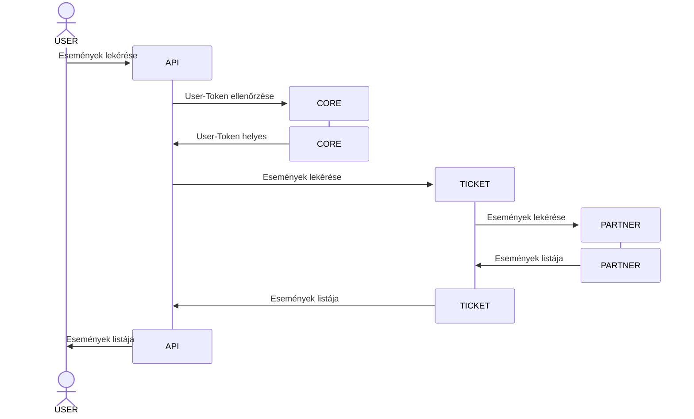
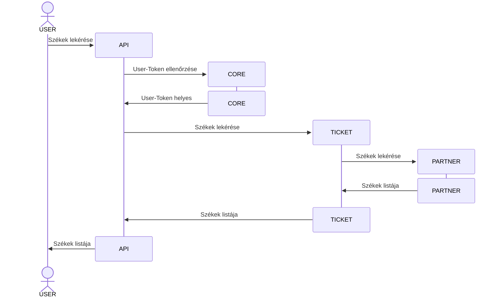
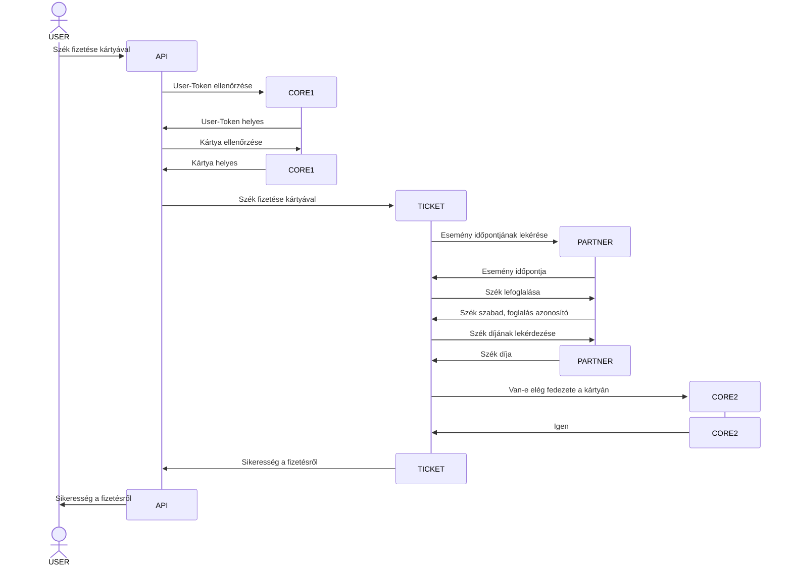

# Ticketing System

Ticketing rendszer egy prototípus, amely a jegyvásárlással kapcsolatos teendőket hivatott megvalósítani. A rendszer 4 teljesen független komponensből áll.

- API
- CORE
- TICKET
- PARTNER

## API

API komponens hivatott fogadni a beérkező kéréseket és a kérésben szereplő **User-Token** ellenőrzése után a megfelelő komponenshez irányítja a kérést. A **User-Token** ellenőrzéséhez átadja a tokent a **CORE** komponensnek ellenőrzésre.

## CORE

CORE komponens kezeli a Felhasználóhoz kapcsolódó teendőket. A komponenshez tartozik egy adatbázis, amely a tartalmazza felhasználók adatait. A komponens feladata ellenőrzni a **User-Token** helyességét, Van-e elég fedezet a kártyán a díj megfizetésére, illetve, hogy a kártya a megadott felhasználóhoz tartozik-e.

## TICKET

TICKET komponens feladata a jegyvásárlással kapcsolatos teendők lebonyolítása. Ez a komponens kommunikál a **PARTNER** komponenssel az eseménnyel kapcsolatos információk megszerzése végett. Fizetés esetén a **CORE** komponenssel kommunikálva ellenőrzi a fedezetet a kártyán, illetve, hogy az adott eseményre foglalható-e jegy, amit a **PARTNER** komponenssel kommunikálva kapja meg az információt.

## Szekvencia diagram

### Események lekérdezése

### Eseményhez tartozó székek lekérése

### Eseményhez tartozó szék lefoglalása és fizetése

