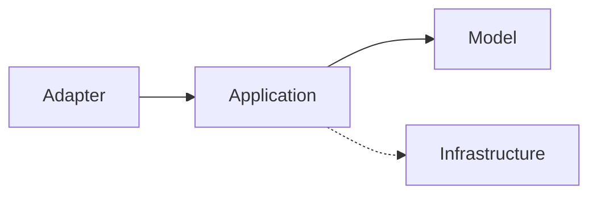

# Technikai leírás

A dokumentáció és funkcionális leírás a **Markdown** leíró nyelvvel, illetve a szekvencia diagram a **Mermaid** leíró eszközzel készült, amelyet a **Documentation.md** tartalmazza.

Visual Studio Code által könnyen megtekinthetőek.

## Technológiák

- Java 21
- Apache Maven 3.9.5
- Spring Boot 3.1.5
- Spring Integration
- H2
- Logback
- SpringDoc-OpenAPI 2.2.0

## Komponensek felépítése

Architectúra az általam választott **Hexagonal architecture** módosított változata.

- Adapter layer
- Model layer
- Application layer
- Infrastructure layer

### Adapter

Adapter az entry-point és tartalmazza a komponens **RestController**-jét, és így a komponens által kiajánlott endpointokat.

### Model

Model tartalmazza azokat az objektumot vagy objektumokat, amelyeken a komponens végez műveleteket.

### Application

Application tartalmazza a **Model**-en végezhető összes műveletet szorítkozva a funkcionális megjelenítésre amennyire lehet a technikai részleteket elrejtve.

### Infrastructure

Infrastructure tartalmazza a komponsens összes technikai részletét.

## Hívási lánc



## Futtatás

Minden komponens tartalmaz egy **application.yaml** konfiurációs fájlt az **src/main/resources** könyvtár alatt, amely tartalmazza **context-path** -ot, **portot** és ha van akkor a többi komponens elérhetőségével kapcsolatos **url**-t.

Minden komponens egy Spring Boot alkalmazás és függetlenül futtathatóak:

```
mvn spring-boot:run
```
